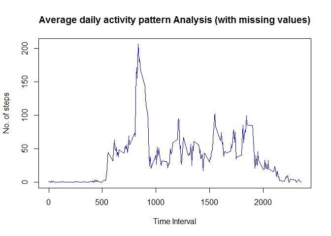

# Reproducible Research Course Project 1
JPV  
Sunday, April 19, 2015  

###Analysis 1 : Mean Total Number of steps taken per day (with missing values). 


```r
raw_data<-read.csv("activity.csv",header=T,sep=",")
day_aggr<-aggregate(steps~date, data=raw_data, sum)
summary(day_aggr)
```

```
##          date        steps      
##  2012-10-02: 1   Min.   :   41  
##  2012-10-03: 1   1st Qu.: 8841  
##  2012-10-04: 1   Median :10765  
##  2012-10-05: 1   Mean   :10766  
##  2012-10-06: 1   3rd Qu.:13294  
##  2012-10-07: 1   Max.   :21194  
##  (Other)   :47
```

```r
median_value<-as.integer(median(day_aggr$steps))
mean_value<-as.integer(mean(day_aggr$steps))
```

**The mean and median for the number of steps taken per day is 10766 and  10765 respectively.**

Here is the histogram showing frequency of number of stes per day shown below :


```r
hist(day_aggr$steps, xlab="Number of steps per day" ,main="Histogram (with missing values)",col="yellow")
```

 

### Analysis 2 : Average daily activity pattern Analysis (with missing values)


```r
int_aggr<-aggregate(steps~interval, data=raw_data, mean)
plot(int_aggr$interval,int_aggr$steps, type="l",col="blue", xlab="Time Interval",ylab="No. of steps",main="Average daily activity pattern Analysis (with missing values)")
```

 

**Interval (5 mins) with maximum number of average steps shown below;**


```r
int_aggr[which.max(int_aggr$steps),]
```

```
##     interval    steps
## 104      835 206.1698
```

### Analysis 3: Missing values (NA's) in the data set


```r
Total_rows<-nrow(raw_data)
steps_NA<-nrow(raw_data[is.na(raw_data$steps),])
date_NA<-nrow(raw_data[is.na(raw_data$date),])
interval_NA<-nrow(raw_data[is.na(raw_data$interval),])
```
Number of records in the raw data  : 17568

Missing values for "steps" column : 2304

Missing values for "date" column  : 0

Missing values for "interval" column  : 0

### Imputing missing values strategy:

Strategy - Missing values for "steps" has been replaced with average value for the day and interval combination.


```r
raw_data_No_NA<-raw_data[!is.na(raw_data$steps),]
NA_data<-raw_data[is.na(raw_data$steps),]
NA_data_merge<-merge(NA_data,int_aggr,by="interval")
names(NA_data_merge)[4]<-paste("steps")
NA_data_impute<-NA_data_merge[,c(4,3,1)]
clean_data<-rbind (raw_data_No_NA,NA_data_impute)
clean_data_day_aggr<-aggregate(steps~date, data=clean_data, sum)
```

Cleaned data is then aggregated at day level to perform Analysis 1 for imputed missing values


### Analysis 4 : Repeat Analysis 1 with the dataset with imputed missing values


```r
summary(clean_data_day_aggr)
```

```
##          date        steps      
##  2012-10-01: 1   Min.   :   41  
##  2012-10-02: 1   1st Qu.: 9819  
##  2012-10-03: 1   Median :10766  
##  2012-10-04: 1   Mean   :10766  
##  2012-10-05: 1   3rd Qu.:12811  
##  2012-10-06: 1   Max.   :21194  
##  (Other)   :55
```

```r
median_value_clean<-as.integer(median(clean_data_day_aggr$steps))
mean_value_clean <-as.integer(mean(clean_data_day_aggr$steps))
hist(clean_data_day_aggr$steps, xlab="Number of steps per day" ,main="Histogram (After imputing missing values)",col="green")
```

 

**After replacing missing values with day/interval average, the mean and median are 10766 and  10766 respectively.**


Do these values differ from the estimates from the first part of the assignment?

- Yes. Mean and median values are same after imputing missing values.

What is the impact of imputing missing data on the estimates of the total daily number of steps ?

- After imputing, median and mean are close to each other (infact they are equal after imputing). This indicates that the imputing strategy followed in the analysis is good. 


### Analysis 5 : Are there differences in activity patterns between wwekdays and weekends ?


```r
library(ggplot2)

day <- weekdays(as.Date(clean_data$date))
dayofweek <- vector()
for (i in 1:nrow(clean_data)) {
  if (day[i] == "Saturday") {
    dayofweek[i] <- "Weekend"
  } else if (day[i] == "Sunday") {
    dayofweek[i] <- "Weekend"
  } else {
    dayofweek[i] <- "Weekday"
  }
}
clean_data$dayofweek <- dayofweek
clean_data$dayofweek <- factor(clean_data$dayofweek)

steps_day <- aggregate(steps ~ interval + dayofweek, data = clean_data, mean)
names(steps_day) <- c("interval", "dayofweek", "steps")

ggplot(steps_day, aes(x=interval, y=steps)) + 
  geom_line(color="blue") + 
  facet_wrap(~ dayofweek, nrow=2, ncol=1) +
  labs(x="Interval", y="Number of steps")  
```

 

From the above plots, we can infer following points:

1.  Activities on a typical weekday is more or less routine except for a spike during noon (probably due to gym or sporting activities during the period). 

2.  Weekends are more active than week days and the efforts are distributed evenly.

 
 

----------------------------------------------------------- End of Report -----------------------------------------------------------------

